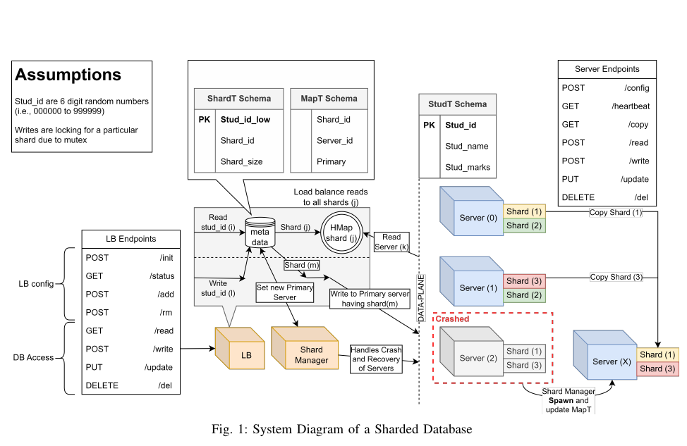
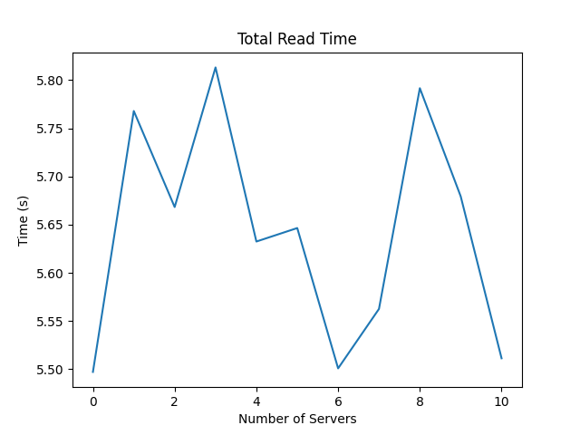
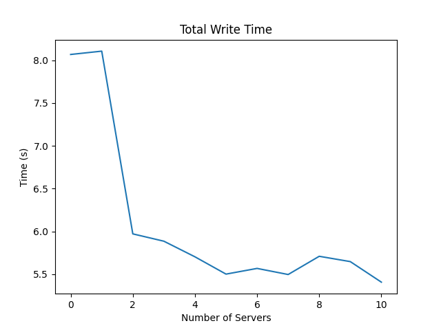

# Implementing a Write-Ahead Logging for consistency in Replicated Database with Sharding
This assignment implements a sharded database that stores one table in multiple shards distributed across several server containers. It also has a Write-Ahead Logging(WAL) mechanism for maintaining consistency among the replicas of the shards that are distributed among various servers. WAL is employed to guarantee that no data is lost and that the database can recover to consistent state after an unexpected shutdown.
### System design


# Design choices
- ### Database choice
    We are using mysql as it was recommended for this assignment. 
- ### Selection of primary server at startup
    We have chosen to go with a random server as it doesn't matter, all the server are in the same state.
- ### Selection in case of primary server failure
    Inspired by RAFT algo, we are choosing the server with most updated logs. If any two servers have the updated log, selection is random as it doesn't matter.
- ### Majority of the secondary server doesn't respond
    In that case the transaction fails implying a problem on the server side.
- ### Log file design
    Each of the server maintain a log file containing the following entry format. ```Checksum-shard-data```. Each entries correspond to the transaction in database\
    Checksum ensures that we don't work with corrupted entries. We first take the checksum of shard-data and write it to file. After that we write shard and data to file. At using entries we ensure that checksum of shard and entries matches with the entry in log file.
# Analysis
### Task 1 (Default configuration)
    Total read time: 4.105234622955322  seconds
    Total write time: 6.000260353088379  seconds
    Average read time: 0.004105234622955322  seconds
    Average write time: 0.006000260353088379  seconds

### Task 2 (Number of shard replicas )
    Total read time: 4.543379783630371  seconds
    Total write time: 6.474789381027222  seconds
    Average read time: 0.004543379783630371  seconds
    Average write time: 0.006474789381027222  seconds
### Task 3 
 
 
